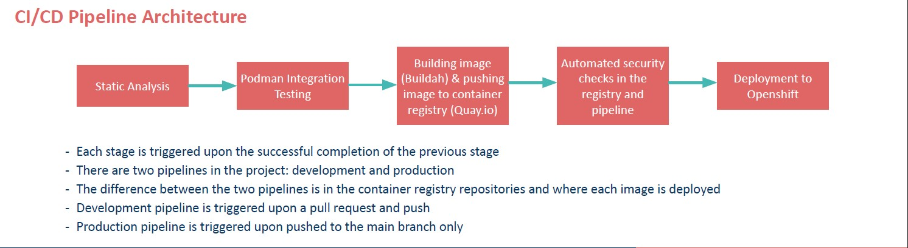

## Introduction
 - Our team created a multi user kanban board that was deployed using a modern CI/CD pipeline with container based technology based on Red Hat for IBM. 
   The project was created with the help of [Mihai Creveti](https://github.com/crivetimihai) and [Panpan Lin](https://github.com/panpan-lin) from IBM.   
 - The backend team consisted of [Aoife Simm](https://github.com/simmma) , [Pavel Petrukhin](https://github.com/cppavel)  , [Merlin Prasad](https://github.com/merlinpr4) and [Wen Geng Lin](https://github.com/Wlin29). Backend repository : [Backend Repository](https://github.com/tcd-ibm/sweng.kanban.backend) 
 - The frontend team consisted of [Peader Kenny](https://github.com/Peadar-Kenny) , [Leah O Conner](https://github.com/loconno5) and [Yongjia Li ](https://github.com/JeffLeeBYD). Frontend repository : [Frontend Repository](https://github.com/tcd-ibm/sweng.kanban.frontend) 

 
 The aim of the project was to gain familiarity with open source development practices and employ the major software development and design principles used in industry such as CI/CD pipelines and automated testing . 
 
## Ci/CD pipeline implementation
We created a CI/CD pipeline using Github Actions by doing the following :

## Helpfull links
The following is a list of links that helps explain our project development approach :

* [CI/CD pipeline setup guide](./documentation/PipelineSetUpGuide.md)
* [API requests guide](./documentation/ApiDocumentation.md)
* [Architectural Decisions ](./documentation/ArchitecturalDecisionsCICD.md)

## Further reading
A list of reports created as part of this module.

